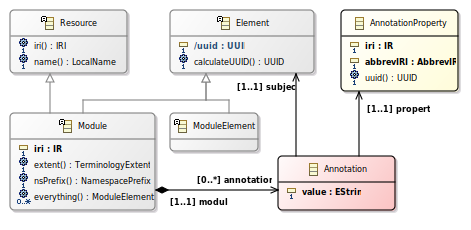



# OML Common Definitions

This clause specifies the common abstractions underlying all constructs in OML.
Any kind of [OML Element] can be the subject of an [OML Annotation] for a particular
[OML AnnotationProperty]. This corresponds to a limited form of annotation compared to [OWL2 Annotations].

[OML Element] is the root of all logical constructs in OML that map to logical constructs
in [OWL2-DL] with [SWRL] rules.
[OML Module] is the root of all logical constructs in OML that map mapped to an [OWL2-DL Ontology].
The logical axioms of an [OML Module] correspond to the mapping of its constituent [OML ModuleElement](s).

Syntactically and semantically, every [OML Element] is globally identifiable based on
a derived Version 5 namespace-based UUID. The derivation of this UUID depends on whether
the [OML Element] has intrinsic or extrinsic identity.
- An [OML Resource] has intrinsic identity thanks to its IRI; which must be globally unique.
  The UUID is a function of the IRI only.
- A non-[OML Resource] has extrinsic identity because it is existentially
  dependent on one or more [OML Element]s. The UUID is a function of the UUIDs of all of its
  existentially dependent [OML Element]s.

